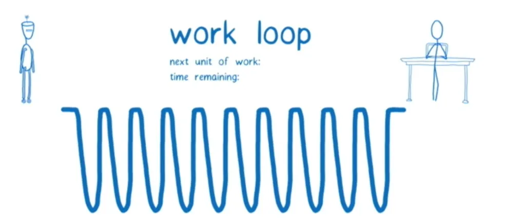
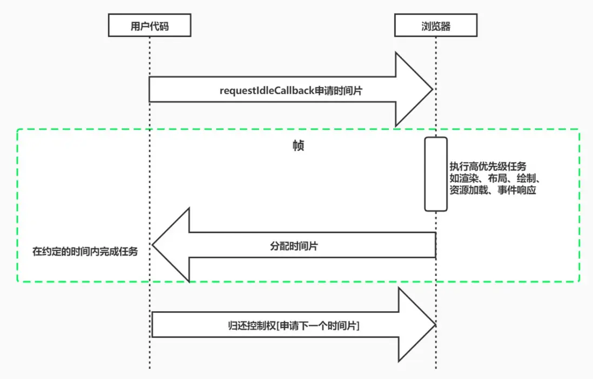
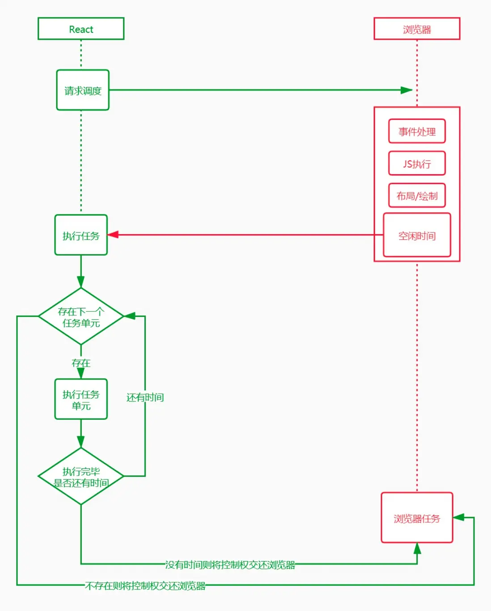
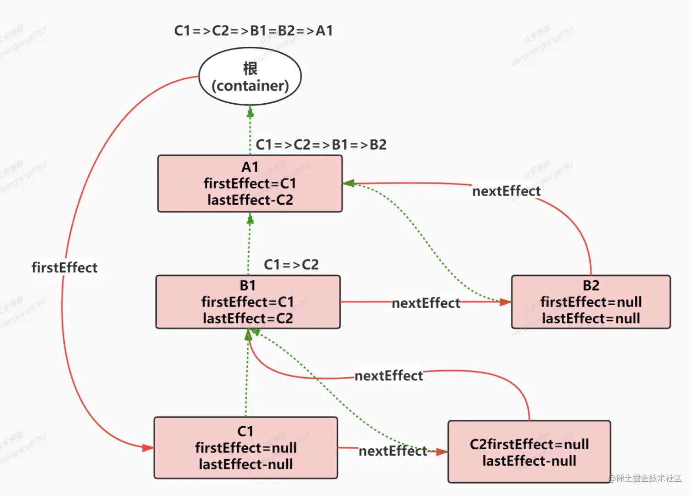
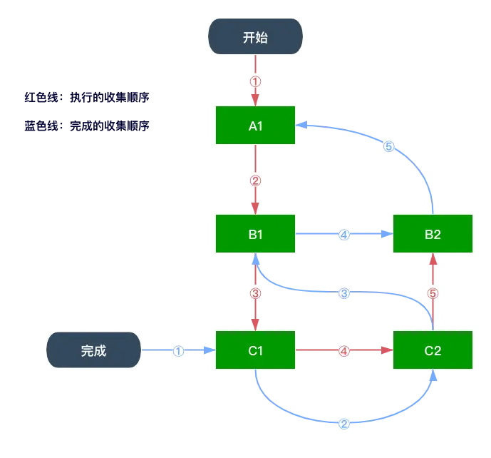

- [react 工作流程](#react-工作流程)
  - [Virtual DOM](#virtual-dom)
  - [react 的架構](#react-的架構)
    - [調度層 Scheduler](#調度層-scheduler)
    - [協調層 Reconciler](#協調層-reconciler)
    - [渲染層 Renderer](#渲染層-renderer)
  - [從 react element 到 fiber tree](#從-react-element-到-fiber-tree)
  - [更新的本質](#更新的本質)
  - [時間切片 time slice](#時間切片-time-slice)
  - [工作過程](#工作過程)
    - [雙緩存 fiber tree](#雙緩存-fiber-tree)
    - [創建更新 tree](#創建更新-tree)
  - [調和 Reconcile](#調和-reconcile)
  - [diff 算法](#diff-算法)
    - [核心思想](#核心思想)
    - [比較過程](#比較過程)
      - [情況 1 - before: 列表，after: 單節點](#情況-1---before-列表after-單節點)
      - [情況 2 - before: 列表，after: 列表](#情況-2---before-列表after-列表)
        - [🌰 為 type 都一致的情況，只有 key 不同的情況](#-為-type-都一致的情況只有-key-不同的情況)
        - [🌰 key 沒有設置或不同的情況](#-key-沒有設置或不同的情況)
    - [判斷新建的節點，是否有變化](#判斷新建的節點是否有變化)
    - [發生變化後要如何更新？](#發生變化後要如何更新)
  - [Effect](#effect)
  - [Fiber](#fiber)
    - [所以 fiber 是什麼？](#所以-fiber-是什麼)
      - [特性](#特性)
      - [window.requestAnimationFrame \& window.requestIdleCallback](#windowrequestanimationframe--windowrequestidlecallback)
        - [react 沒有用 requestIdleCallback？](#react-沒有用-requestidlecallback)
        - [為什麼不能用 setTimeout 來代替 MessageChannel？不是都是呼叫執行宏任務嗎？](#為什麼不能用-settimeout-來代替-messagechannel不是都是呼叫執行宏任務嗎)
      - [實際模擬過程](#實際模擬過程)
        - [遍歷順序和 render 階段](#遍歷順序和-render-階段)
        - [commit 階段 - 收集 Effect List](#commit-階段---收集-effect-list)

# react 工作流程

### Virtual DOM

是一種編成概念，由 React 在 2013 率先開拓，後續被許多不同的框架採用。
在這個概念裡面，UI 以一種理想化的，或者說是虛擬的形式被保存在內存中，通過 ReactDOM 等套件包轉換成 fiber 結構後，使它跟真的的 DOM 同步。同步的過程在 react 當中稱之為調和或是協調 Reconcile。而協調的核心就是 VDOM diff 算法。

用物件表現 DOM 的信息和結構，當狀態變更時，重新渲染這個物件結構（VDOM)

重點整理：

1. jsx -> react element -> fiber tree -> dom tree
2. 更新發生調和 同時存在兩顆樹，新的樹會取代舊的樹，發生變化的 node 會標記 effect ，v17 之前調和完成後 以單鏈表的結構收集，順序為子節點、子節點兄弟節點、父節點，但性能問題加上內存管理不好，就使用一種新的數據結構 effectList 雙向鏈表來標記
3. 如果組件沒有執行 render，就是直接複用舊樹節點，除此之外要經過 diff 算法 來判斷是要克隆還是創建
4. diff 算法是比較已經匹配的父節點的子節點，不會跨父節點比較
5. diff 算法如果 key 和 type 相同則克隆，不然就重新創建

### react 的架構

在 v16 版本中就開始分為三層：調度層、協調層、渲染層

- **調度層 Scheduler** : 調度任務的優先級，高優先級的優先進入協調層
- **協調層 Reconciler** : 構建 fiber tree，diff 比對，找出差異，標記 fiber node 準備要進行的 dom 操作
- **渲染層 Renderer** : 負責將發生變化的部分渲染到頁面上

#### 調度層 Scheduler

v15 原先用遞歸進行 vd 的比對，中間是同步進行，無法中斷，長期佔用主線程，會導致畫面無法交互或是掉幀的狀況。v16 之後採用 循環模擬遞歸，並且利用瀏覽器空閑時間處理。原先 react 想利用 `requestIdleCallback` 但最終支援度和觸發頻率不穩定等問題，改官方自身實現任務調度，這個庫就叫做 Scheduler。可以實現瀏覽器空閒時執行任務，還可以調度任務的優先級，高優先級的優先進入協調層。

#### 協調層 Reconciler

v15 原先協調器和渲染器交替工作，找出差異就更新。v16 中，協調器緊緊只是找出差異後標記，之後交給渲染器更新。

#### 渲染層 Renderer

渲染器根據協調器在 fiber node 打上的標記，同步執行對應的 dom 操作。
要注意的是，調度層和協調層是在內存中處理，所以可以被打斷，但渲染器被設定不可中斷。

### 從 react element 到 fiber tree

v17 之前，jsx 經過 babel 後，轉譯為 `React.createElement`。v17 之後，和 babel 進行了合作，使用 babel 進行上述的處理，所以在 React17.0 我們不用引入 React 也可以運行我們的 jsx，自動從套件包中引入新的入口函式調用。

執行後返回 **AST 抽象語法樹**，再轉換成 **fiber tree**，對應到 **dom tree**，==在構建 tree 的過程中以二叉樹中序遍歷的方式，從 child 延伸，直到 child 完成後尋找 return 指向 ，再找 sibling 指向。==
首屏渲染完成後，進入交互更新階段。
更新時會產生兩個 **fiber tree**，一棵是對應當前顯示，一個是對應更新將要顯示 **workInProgress fiber tree**，更新完成後 即替換掉舊的。

> fiber? 不是 React 獨有的，是一種常見的術語，在 Ruby, PHP 中都有應用。可中斷可暫停。React v16 引入了 fiber 的協調引擎(Incremental rendering)，目的是使 VDOM 可以進行增量式渲染，將渲染拆分多塊，分散在不同幀處理。支持暫停和終止複用工作任務(work)，給不同任務賦予優先級，給併發提供基礎，更好的支持錯誤邊界。

```js
// 二叉樹中序遍歷
function middleOrderTraversalBinaryTree(root) {
  if (!root) return;
  middleOrderTraversalBinaryTree(root.left);
  middleOrderTraversalBinaryTree(root.right);
}
```

```js
/**
在更新的過程當中，會做三件事：
1. 會有一個指針 `workInProgress` 指向當前正在處理的節點
2. 每個節點會有“是否處理完成”的標記。
3. 有三種指針
   1. `return`: 子節點都會有指針指向父節點
   2. `child`: 父節點的第一個子節點
   3. `sibling`: 子節點的兄弟節點
*/

  A
  |
child
  |
  B   --sibling-->  C  --sibling-->  D
  |                 |
child             child
  |                 |
  E                 F  --sibling-->  G


{
    type: 'A'
    props: {
        children: [{
            type: 'B',
            props: {
                children: [{
                    type: 'e',
                    props: {}
                }]
            }
        }, {
            type: 'C',
            props: {
                children: [{
                    type: 'F',
                    props: {}
                }, {
                    type: 'G',
                    props: {}
                }]
            }
        }, {
            type: 'D',
            props: {}
        }]
    }
}
```

開始處理:

- <font color=#F00><未完成></font>
- <font color=#0000FF><已完成></font>

1. 處理第一層節點: <font color=#F00>A</font>
   1. 標記 `workInProgress`：<font color=#F00>A</font>
2. 處理第二層節點: <font color=#F00>B C D</font>
   1. 指針指向
      1. <font color=#F00>A</font> --child--> <font color=#F00>B</font>
      2. <font color=#F00>B</font> --sibling--> <font color=#F00>C</font> --sibling--> <font color=#F00>D</font>
      3. <font color=#F00>B</font> --return--> <font color=#F00>A</font>
      4. <font color=#F00>C</font> --return--> <font color=#F00>A</font>
      5. <font color=#F00>D</font> --return--> <font color=#F00>A</font>
   2. 標記 `workInProgress`：<font color=#F00>B</font>
      1. 找他的子節點：<font color=#F00>E</font>
3. 處理第三層節點: <font color=#F00>E</font>
   1. 指針指向
      1. <font color=#F00>B</font> --child--> <font color=#F00>E</font>
      2. <font color=#F00>E</font> --return--> <font color=#F00>B</font>
   2. 標記 `workInProgress`：<font color=#F00>E</font>
      1. 找子節點：null， <font color=#0000FF>E</font>
   3. <font color=#0000FF>E</font> --return--> <font color=#F00>B</font>
4. 處理第二層節點: <font color=#F00>B C D</font>
   1. 標記 `workInProgress`：<font color=#F00>B</font>
   2. <font color=#0000FF>B</font>
   3. <font color=#0000FF>B</font> --sibling--> <font color=#F00>C</font>
   4. 標記 `workInProgress`：<font color=#F00>C</font>
      1. 找子節點： <font color=#F00>F, G</font>
5. 處理第三層節點: <font color=#F00>F, G</font>
   1. 指針指向
      1. <font color=#F00>C</font> --child--> <font color=#F00>F</font>
      2. <font color=#F00>F</font> --sibling--> <font color=#F00>G</font>
      3. <font color=#F00>F</font> --return--> <font color=#F00>C</font>
      4. <font color=#F00>G</font> --return--> <font color=#F00>C</font>
   2. 標記 `workInProgress`：<font color=#F00>F</font>
      1. 找子節點：null， <font color=#0000FF>F</font>
   3. <font color=#0000FF>F</font> --sibling--> <font color=#F00>G</font>
      1. 找子節點：null， <font color=#0000FF>G</font>
   4. <font color=#0000FF>G</font> --return--> <font color=#F00>C</font>
6. 處理第二層節點: <font color=#0000FF>B</font><font color=#F00> C D</font>
   1. 標記 `workInProgress`：<font color=#F00>C</font>
   2. <font color=#0000FF>C</font>
   3. <font color=#0000FF>C</font> --sibling--> <font color=#F00>D</font>
   4. 標記 `workInProgress`：<font color=#F00>D</font>
      1. 找子節點： null， <font color=#0000FF>D</font>
   5. <font color=#0000FF>D</font> --return--> <font color=#F00>A</font>
7. 處理第一層節點: <font color=#F00>A</font>
   1. 標記 `workInProgress`：<font color=#F00>A</font>
   2. <font color=#0000FF>A</font>
8. <font color=#0000FF>此時整棵樹已被標記完成</font>

```js
  A
  |
child
  |
  B   --sibling-->  C  --sibling-->  D
  |                 |
child             child
  |                 |
  E                 F  --sibling-->  G
```

---

### 更新的本質

需要將 fiber tree 更新完成後，更新 dom tree 執行生命週期方法
react 內部將一次更新分為兩個階段，**render**、**commit**。

- **render**: 對 fiber tree 做更新操作，收集更新過程中產生的副作用
- **commit**: 處理 render 階段收得的副作用

### 時間切片 time slice

在單線程的機制下，如果一個任務執行時間花費過久，就會堵塞後面的任務。
react 渲染時，**高優先級的任務（ex: 交互、佈局）被某個任務堵塞了**，螢幕就會出現卡頓。為了解決這種問題，react 操照操作系統，引入了時間切片的機制，**在某個時間段內週期性執行任務，週期性地把控制權交還給瀏覽器。**




每個 work 工作單元的時長是 5ms，超過執行時間，就要把控制權交還給瀏覽器

```js
// 偽代碼
// 時間切片的起始，時間戳
let startTime = -1;
// 時間切片，這是個時間段
let frameInterval = 5;

function shouldYieldToHost() {
  const timeElapsed = performance.now() - startTime;
  return timeElapsed >= frameInterval;
}
```

### 工作過程

分為兩階段

- 啟動階段：首屏渲染的整個過程，從無到有建構 fiber tree 和 dom tree。
- 交互階段：發生交互改變結構。

#### 雙緩存 fiber tree

在內存當中構建，完成後替換上一幀，比在渲染時才構建要快！這個技術就叫做雙緩存。

- `current fiber tree`: 當前螢幕顯示的樹
- `workInProgress fiber tree`: 更新產生的樹。
  更新完成後 `workInProgress fiber tree` 會取代 `current fiber tree`。
- alternate: 這個指針存在兩棵樹上，指向彼此，如果要更新，會替換掉舊的樹。
- flags: 標記更新的內容，比方刪除更新插入等等的變化。

#### 創建更新 tree

createElement 執行完畢後，執行 render，正式進入構建階段，在 root 容器節點上建立 fiber node，依次創建子節點。
比較麻煩的是更新。

1. 標記發生更新的節點，複製根節點作為 `workInProgress fiber tree` 的根節點，並且也有指針指向舊樹的 child。
2. `current fiber tree` 會有一個指針 `current` 指向目前處理的對象，同樣 `workInProgress fiber tree` 也有，叫做`workInProgress`。
3. 檢查 `workInProgress` 指向的節點有沒有變化，則複製 `current` 指向的 child 給 `workInProgress fiber tree`，並移動指針 `workInProgress` 和 `current`> APP
4. APP 有標記 Update，複製節點到 `workInProgress fiber tree`，再檢查 APP 的子節點，react Element 和 current.child 比較，發現一樣再複製，，並移動指針 `workInProgress` 和 `current`。以此方式重複流程。
5. 如果發現要刪除的節點，則標記刪除; 如果發現要新增的，則`current`指向 null，`workInProgress`指向新增的結構
6. 最後移動指針 `workInProgress` 和 `current`> 根節點，fiber root node 再把 current 指針指向新的樹，就更新完成、再處理副作用（包含 dom 節點移除，useEffect 的 destory 觸發）

### 調和 Reconcile

==調整 fiber tree 的結構和更新以後的 jsx, dom tree 一致==，在調和過程中整個調和的過程就發生在 `workInProgress fiber tree`，調和的時候主要做三件事

1. 生成 fiber node，==使用 diff 算法，判斷要 clone 還是要 create==

   - <u>clone</u>: 如果在 `current fiber tree` 上有找到匹配的節點，直接複用節點，只需要更新節點屬性或是移動節點。
   - <u>create</u>: 如果在 `current fiber tree` 上沒有找到匹配的節點，則創建。
   - <u>reuse</u>：不用做任何處理。如果 `shouldComponentUpdate` 或是 `memo` 包裹優化後，render 方法不用執行。可以加快 `workInProgress fiber tree` 調和。

2. 找到發生變化的 node，更新 fiber node，標記副作用
3. 收集帶 fiber 的副作用

### diff 算法

『`workInProgress fiber tree` 的 `react element`』 和 『`current fiber tree` 中的 `fiber node`』比較，type (component 或 dom 節點 或 react 提供的標籤) 和 key 完全一致才可以 clone。
這也是為什麼列表都需要有 key，他可以監聽到元素是否發生移動新增刪除，可以優化渲染過程。

#### 核心思想

==以匹配的父節點的子節點做比較，不跨父節點比較。== key 的優先級大於 type。

#### 比較過程

##### 情況 1 - before: 列表，after: 單節點

1. 如果有匹配到某個節點 -> clone，`workInProgress fiber node` 的 `alternate 指針` 指向節點。剩下的標記為刪除。
2. 如果有匹配到某個節點 -> create，`workInProgress fiber node` 的 `alternate 指針` 指向 null。

##### 情況 2 - before: 列表，after: 列表

需要判斷有沒有移動！
在過程當中會定義一個 `lastPlacedIndex` 的指針標示沒有移動的 node

- 如果 `lastPlacedIndex` > oldIndex 則表示 他發生了移動，要移到 `lastPlacedIndex` 之後
- 如果 `lastPlacedIndex` <= oldIndex 則表示 沒有移動，改變 `lastPlacedIndex` 的指向

###### 🌰 為 type 都一致的情況，只有 key 不同的情況

```js
// before current fiber tree
         div   --sibling-->  div   --sibling-->  div  --sibling-->  div
         key:A               key:B               key:C             key:D
index:     0                   1                   2                 3

// after workInProgress fiber tree
         div   --sibling-->  div   --sibling-->  div  --sibling-->  div
         key:C               key:B               key:A             key:D
index:     0                   1                   2                 3
```

從 workInProgress fiber tree 開始

1. 第一個節點 C: 匹配到 `current fiber tree` 的 C，index: 2，定義它為未移動的節點。
   `lastPlacedIndex` = 2
2. 第二個節點 B: 匹配到 `current fiber tree` 的 B index: 1 < `lastPlacedIndex`，表示他移動到了後面
3. 第三個節點 A: 匹配到 `current fiber tree` 的 A index: 0 < `lastPlacedIndex`，表示他移動到了後面
4. 第四個節點 D: 匹配到 `current fiber tree` 的 D index: 3 >= `lastPlacedIndex`，未移動
   `lastPlacedIndex` = 3

###### 🌰 key 沒有設置或不同的情況

- 沒有設置 key: 一開始會一同遍歷，type 相同就 clone，不相同就 create，把舊的打上刪除記號。遇到有 key 值出現了會改變匹配的方式。進入第二階段。
- key 值出現了，但不同: 生成一個 Map，key 為 `current fiber node` 的 key(|| index)，繼續遍歷新的樹，如果有在 Map 中匹配到就 clone，不然就新建。Map 中其他沒有匹配到的 全部標記刪除記號。

```js
// before current fiber tree
      div  --sibling-->  div --sibling-->  div --sibling-->  div  --sibling-->  div --sibling-->  div --sibling--> div --sibling--> div
                                          key:A             key:B             key:C              key:D             key:E            key:F
idx:   0                  1                 2                 3                  4                 5                6                 7

// after workInProgress fiber tree
       p  --sibling-->  div --sibling-->  div --sibling-->  div  --sibling-->  div --sibling-->  div
                                         key:B            key:A               key:G             key:D
idx:   0                 1                 2                 3                  4                 5
```

從 workInProgress fiber tree 開始

1. 第一個節點 p: `current fiber node[0]` 的 div，key === undefined，type 不相同，p 要 create，div 標記刪除
2. 第二個節點: `current fiber node[1]` 的 div，key === undefined，type 相同，
   `lastPlacedIndex` = 1
3. 第三個節點 B: 匹配到 `current fiber tree` 的 A，key 不相同，生成一個 Map 把剩下的 `current fiber node` 放進去，匹配到了 B，
   刪除 Map[B]
   `lastPlacedIndex` = 2
4. 第四個節點 A: 匹配到 Map[A]，標記移動
   刪除 Map[A]
   `lastPlacedIndex` = 2
5. 第五個節點 G: 沒有匹配，創新的，標記新增
6. 第六個節點 D: 匹配到 Map[D]
   刪除 Map[D]
   `lastPlacedIndex` = 5
7. Map 中剩下的節點標記刪除

#### 判斷新建的節點，是否有變化

判斷 props 有無改變，通過比較兩者就可以知道是否要更新屬性
`workInProgress fiber node` 的 `props`: `pendingProps`
`current fiber node` 的 `props`: `memoizedProps`

#### 發生變化後要如何更新？

判斷 type 給予不同的 tag 做不同的處理。
每一次 react element 創建時 props 都是一個新對象，`pendingProps` 也一定和 `memoizedProps`不一樣。
這也是為什麼 當子節點是一個組件時，儘管 props 屬性沒有改變，但依舊會觸發 render 方法，當子組件的 props 和 state 有變化，節點都會更新。

### Effect

Effect 又分很多類型

- Placement: 表節點需要移動或添加
- Update: 更新，比方說 props 變化，使用了 useEffect、useLayoutEffect，
- PlacementAndUpdate: 又移動又變化
- Ref: 初始化要賦值
- Deletion: 觸發 useEffect、useLayoutEffect 返回的 destory
- Snapshot: 類組件 getSnapshotBeforeUpdate
- Passive: 先執行 useEffect 返回的 destory 再異步執行 useEffect callback
- Layout: 先執行 useEffect 返回的 destory 再同步執行 useEffect callback
  ...

v17：在調和完成後，會收將被標記 Effect 的 fiber node 收集成一個單鏈表結構，通過 nextEffect 指針連接，由最下層的子節點開始收集。
收集完成後，分三階段處理：

1. dom 操作之前， before mutation
   - 處理 Snapshot
2. dom 操作，mutation
   - 處理 Deletion、Placement、Update、PlacementAndUpdate
   - 原生的 API setAttribute、removeArrribute、innerHtml、textContent，修改 style，appendChild、insertBefore、removeChild
   - componentWillUnmount、useEffect destory、ref 清空
   - ...
3. layout，mutation
   - ref.current 初始化
   - useLayoutEffect
   - ...

v18：以雙向鏈表來存儲，每個節點包含了要執行的副作用和對應的清理函數
// TODO: 待補充

### Fiber

#### 所以 fiber 是什麼？

是一種數據結構，內容有節點實例、子節點 child、兄弟節點 silbling、父節點 return。也是執行單元，每次執行完，都會檢查還剩下多少時間，沒有時間就將控制權交出去。

##### 特性

1. 增量渲染：可以把任務們均分到每一幀執行
2. 暫停、終止、複用渲染任務
3. 不同更新的優先級：比方高優先級的輸入事件、低優先級的網路請求
4. 併發模式：可終止高消耗非緊急的渲染




##### window.requestAnimationFrame & window.requestIdleCallback

- 幀的概念
  - 大多數螢幕都是一秒六十次，大概是 16.6 毫秒一幀，幀數(fps)越高越流暢。
  - 每一幀包含樣式計算佈局和繪製
  - JS 引擎和頁面繪製在同一線程當中，GUI 渲染和 JS 執行是互斥的，如果 JS 引擎任務執行時間過長，就會推遲渲染
- 為了讓動畫等任務可以按照優先級渲染，需要使用 window.requestAnimationFrame & window.requestIdleCallback


```js
/**  requestAnimationFrame，
- 參數 time: 表執行開始到現在的時間，相當於 performance.now()
**/
let start;
let root = document.getElementById("root");
function animate(timestart) {
  // timestart 相當於 performance.now()
  //   console.log(timestart);
  if (!start) {
    start = timestart; // 只是記錄一開始執行的時間
  }
  //   console.log("ttttt", timestart, timestart - start);
  root.style.transform = `translate(${+timestart * 0.1}px)`;
  if (timestart < 2000) {
    // 必須主動呼叫下一次渲染
    window.requestAnimationFrame(animate);
  }
}
window.requestAnimationFrame(animate);
```

```js
// requestIdleCallback：在主要任務執行完後有空閒時間就可以執行
// 可執行低優先的任務
// 實例方法：IdleDeadline.timeRemaining() 表示現在 一幀中剩下的時間
function sleep(duration) {
  let now = Date.now();
  while (duration + now > Date.now()) {
    return;
  }
}
// 空閒時回調
let works = [
  () => {
    console.log("task 1");
    sleep(300);
  },
  () => {
    console.log("task 2");
    sleep(300);
  },
  () => {
    console.log("task 3");
  },
  () => {
    console.log("task 4");
  },
  () => {
    console.log("task 5");
  },
];
function runWorks() {
  let w = works.shift();
  w();
}
function progress(deadline) {
  // 如果有剩餘時間就執行任務
  // 實例方法：https://developer.mozilla.org/zh-CN/docs/Web/API/IdleDeadline
  // IdleDeadline.timeRemaining()
  let remaining = deadline.timeRemaining();
  console.log("剩下多少時間：", remaining);
  // 如果有時間而且還有任務就執行
  if (remaining > 0 && works.length > 0) {
    runWorks();
  }
  if (works.length > 0) {
    window.requestIdleCallback(progress);
  }
}
window.requestIdleCallback(progress);

/**
     * 剩下多少時間： 11.7
       task 1
       剩下多少時間： 12.6
       task 2
       剩下多少時間： 9.3
       task 3
       剩下多少時間： 49.9 // 為何會變成 49ms??
       task 4
       剩下多少時間： 49.9
       task 5

       如果執行的任務較少，瀏覽器會把一幀的時間拉長，
       讓頁面不用頻繁的更新，可以處理更多不重要的程式碼 requestIdleCallback，
       但用戶在變成100ms以上才會感受到變慢
     * **/
```

###### react 沒有用 requestIdleCallback？

React 選擇用原生的 api - MessageChannel，來實現 requestIdleCallback。

```js
// 可以建立兩個通道，互相傳遞訊息
// MessageChannel 是建立一個宏任務
let channel = new MessageChannel();
let port1 = channel.port1;
let port2 = channel.port2;
port1.onmessage = function (e) {
  console.log("port1.onmessage", e.data);
};
port2.onmessage = function (e) {
  console.log("port2.onmessage", e.data);
};
port1.postMessage("post1");
port2.postMessage("post2");
```

```js
const channel = new MessageChannel();
let callback;
const port1 = channel.port1;
const port2 = channel.port2;
port2.onmessage = function ({ data: { deadTime } }) {
  const currentTime = performance.now();
  const didTimeout = deadTime <= currentTime;
  // 如果還有時間的話就去執行 callback
  if (!didTimeout && callback) {
    callback({ didTimeout, timeRemaining: currentTime - deadTime });
  }
};
window.requestIdleCallbackPolyfill = function (callback, options) {
  window.requestAnimationFrame((raftime) => {
    console.log(raftime);
    port1.postMessage({
      // 發一個宏任務
      deadTime: raftime + 16.6, // 假設現在更新頻率是 16.6
    });
    callback = callback;
  });
};
```

React 為什麼選擇使用 MessageChannel 來實現類似 requestIdleCallback 的功能，主要是因為以下幾個原因：

1. <u>兼容性和一致性</u>：
   requestIdleCallback 在所有瀏覽器中的支持情況不一樣，特別是在一些舊版瀏覽器或不支持這個 API 的環境下，React 希望能在不同的環境中保持一致的行為。使用 MessageChannel 可以提供更一致的跨瀏覽器行為。

2. <u>精細控制和穩定性</u>：
   **呼叫的間隔不穩定，因特定的裝置效能和目前的瀏覽器任務而異，呼叫的頻率太低了，據說有網友檢查到只有 20 次/每秒**。MessageChannel 和 postMessage 使得 React 可以更精確地控制執行時機，並且在任務調度中提供更高的穩定性。

3. <u>更高的控制權</u>：
   使用 MessageChannel 使得 React 團隊可以完全掌控任務的調度過程。他們可以自行決定如何處理閒置時間，而不需要依賴瀏覽器的實現。這有助於 React 更好地優化性能和用戶體驗。

4. <u>測試和調試</u>：
   自己實現的調度機制可以讓 React 團隊更容易進行測試和調試，特別是在測試不同的瀏覽器和環境下的行為時。

###### 為什麼不能用 setTimeout 來代替 MessageChannel？不是都是呼叫執行宏任務嗎？

- MessageChannel 的執行時機會早於 setTimeout
- setTimeout(fn,0) 所建立的宏任務，會有至少 4ms 的執行時差
- 如果目前環境不支援 MessageChannel 時，會預設使用 setTimeout

##### 實際模擬過程

###### 遍歷順序和 render 階段

這邊暫時先用 window.requestIdleCallback

1. 請求瀏覽器分配時間段，執行任務
2. 用變數 `nextUnitWork` 來記下一個要處理的 node
3. 如果還有時間且 `nextUnitWork` 還有節點尚未處理，則進入處理工作
4. 創建 dom 節點，標記完成
5. 完成後將 `nextUnitWork` 指向節點的 child，，重複 4.，
   - 如果沒有 child，`nextUnitWork` 指向節點的 sibiling，重複 4.
   - 如果也完成，則 `nextUnitWork` 指向節點的 return
6. render 階段完成，準備進入 commit 階段

###### commit 階段 - 收集 Effect List

1. 將待有副作用的 fiber node 節點收集起來，形成一個單鏈表。
2. 通過 commitWork 方法，將收集的副作用進行提交，修改真實的 dom
3. Effect List 的順序和 fiber 節點遍歷的完成順序一致
   
   

```js
//   <div id="A1">
//     <div id="B1">
//       <div id="C1"></div>
//       <div id="C2"></div>
//     </div>
//     <div id="B2"></div>
//   </div>

let container = document.getElementById("root");
let C1 = { type: "div", key: "C1", props: { id: "C1", children: [] } };
let C2 = { type: "div", key: "C2", props: { id: "C2", children: [] } };
let B1 = {
  type: "div",
  key: "B1",
  props: { id: "B1", children: [C1, C2] },
};
let B2 = { type: "div", key: "B2", props: { id: "B2", children: [] } };
let A1 = {
  type: "div",
  key: "A1",
  props: { id: "A1", children: [B1, B2] },
};

let workInProgressRoot = {
  key: "ROOT",
  /**
   * 節點實例，
   * 對於root來說，這裡保留dom節點
   * 對於class組件來說，保留class實例
   * 對於函式組件來說，是空的，因為沒有實例
   *  */
  stateNode: container,
  props: { children: [A1] },
};
// 下一個要處理的單元
let nextUnitWork = workInProgressRoot;
// 對應 diff 結果是要替換
const PLACEMEMT = "PLACEMEMT";
// 工作循環
function workLoop(deadline) {
  // 2. 開始工作！
  // 如果當前處理的節點存在，而且還有剩餘的時間
  // 就去構建 下一個 fiber node
  console.log(nextUnitWork);
  while (nextUnitWork && deadline.timeRemaining() > 0) {
    nextUnitWork = performUnitWork(nextUnitWork);
  }
  // 5. 如果沒有下一個節點了，進入第二階段 commit
  // 上圖的藍色線
  if (!nextUnitWork && workInProgressRoot) {
    commitRoot();
  }
  // 繼續下一幀的調度任務
  // requestIdleCallback(workLoop, { timeout: 500 });
}

function completeUnitOfWork(currentFiber) {
  const returnFiber = currentFiber.return;
  if (returnFiber) {
    if (!returnFiber.firstEffect) {
      returnFiber.firstEffect = currentFiber.firstEffect;
    }
    if (currentFiber.lastEffect) {
      if (returnFiber.lastEffect) {
        returnFiber.lastEffect.nextEffect = currentFiber.firstEffect;
      }
      returnFiber.lastEffect = currentFiber.lastEffect;
    }

    if (currentFiber.effectTag) {
      if (returnFiber.lastEffect) {
        if (currentFiber.key === "B1") {
          console.log(
            "returnFiber.returnFiber.lastEffect",
            returnFiber.lastEffect.key
          );
          console.log("returnFiber.firstEffect", returnFiber.lastEffect);
        }
        returnFiber.lastEffect.nextEffect = currentFiber;
      } else {
        returnFiber.firstEffect = currentFiber;
      }
      returnFiber.lastEffect = currentFiber;
    }
  }
}
// 構建 fiber tree
function performUnitWork(fiber) {
  // 4. 創建 dom節點
  startWork(fiber);
  // 如果有子節點優先處理子節點，以『深度優先』
  if (fiber.child) {
    return fiber.child;
  }
  // 如果沒有子節點
  while (fiber) {
    // 此節點已經完成
    completeUnitOfWork(fiber); // 收集effect
    // 檢查是否有兄弟節點
    if (fiber.sibling) {
      return fiber.sibling;
    }
    fiber = fiber.return; // 回到父層級，再去找父的兄弟節點
  }
}
function startWork(currentFiber) {
  // console.log("childFiber", currentFiber);
  if (!currentFiber.stateNode) {
    currentFiber.stateNode = document.createElement(currentFiber.type); //创建真实DOM
    for (let key in currentFiber.props) {
      //循环属性赋赋值给真实DOM
      if (key !== "children" && key !== "key")
        currentFiber.stateNode.setAttribute(key, currentFiber.props[key]);
    }
    console.log("currentFiber", currentFiber);
  }

  let previousFiber;
  // 创建子fiber
  currentFiber.props.children.forEach((child, index) => {
    let childFiber = {
      tag: "HOST",
      type: child.type,
      key: child.key,
      props: child.props,
      return: currentFiber,
      effectTag: "PLACEMENT",
      nextEffect: null,
    };
    if (index === 0) {
      currentFiber.child = childFiber;
    } else {
      previousFiber.sibling = childFiber;
    }
    previousFiber = childFiber;
  });
}
function commitRoot() {
  let fiber = workInProgressRoot.firstEffect;
  while (fiber) {
    console.log(fiber.key); //C1 C2 B1 B2 A1
    commitWork(fiber);
    fiber = fiber.nextEffect;
  }
  workInProgressRoot = null;
}
function commitWork(currentFiber) {
  currentFiber.return.stateNode.appendChild(currentFiber.stateNode);
}

// 1. 請求瀏覽器分配時間 requestIdleCallback，只要有時間就會去執行 workloop;
requestIdleCallback(workLoop, { timeout: 1000 });
```

---

> 學習資料：
>
> [React Fiber 原理](https://juejin.cn/post/6962449722275528712)
>
> [由淺入深 React 的 Fiber 架構](https://segmentfault.com/a/1190000022960789#item-6-13)
>
> [手撕 React Fiber 源码](https://www.bilibili.com/video/BV1vP4y1w7TN/?share_source=copy_web&vd_source=34ac1b8e3ce252ba440c815f2d4f6cd3)
>
> [利用 react scheduler 思想，实现任务的打断与恢复](https://juejin.cn/post/7345746216150417446)
