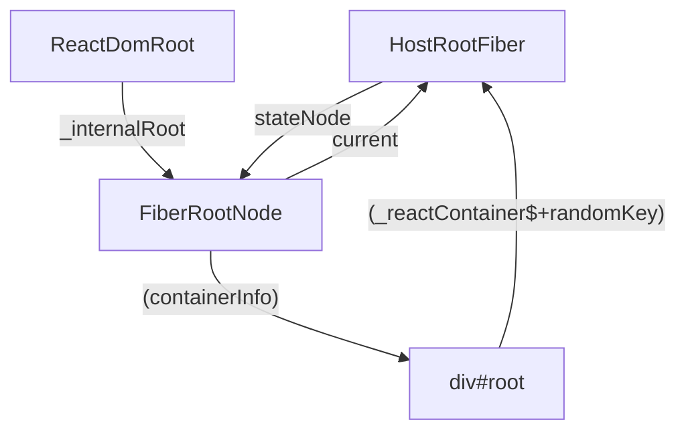

# createRoot

```js
import { createRoot } from "react-dom/client";
import App from "./App";
import * as React from "react";

const root = createRoot(document.getElementById("root"));

root.render(<App />);
```

> `react-debugger/src/react/packages/react-dom/src/client/ReactDOMRoot.js`

1.  驗證 container 的合法性，或者是否已經使用過
2.  創建 FiberRootNode 指向 fiber tree，rootFiber 和 fiberRoot 把他們關聯起來
3.  事件代理
4.  返回 React.DOMRoot 實例

```js
/**
 * 創造根節點容器
 * @param {*} container 渲染的容器 必須要是 dom element
 * @param {*} options
 * @returns
 */
export function createRoot(container, options) {
  // 判斷是否符合容器的規範
  // 可以是元素節點、document節點、註釋節點（會渲染到註釋之前）
  if (!isValidContainer(container)) {
    throw new Error("createRoot(...): Target container is not a DOM element.");
  }

  // 如果傳入body或已使用的元素，發出警告（開發環境）
  warnIfReactDOMContainerInDEV(container);

  let isStrictMode = false; // 嚴格模式
  let concurrentUpdatesByDefaultOverride = false; // 更新模式
  let identifierPrefix = ""; // 前綴
  let onRecoverableError = defaultOnRecoverableError; // 可恢復的錯誤處理辦法
  let transitionCallbacks = null; // 過度更新回調

  if (options !== null && options !== undefined) {
    if (options.unstable_strictMode === true) {
      isStrictMode = true;
    }
    if (
      allowConcurrentByDefault &&
      options.unstable_concurrentUpdatesByDefault === true
    ) {
      concurrentUpdatesByDefaultOverride = true;
    }
    if (options.identifierPrefix !== undefined) {
      identifierPrefix = options.identifierPrefix;
    }
    if (options.onRecoverableError !== undefined) {
      onRecoverableError = options.onRecoverableError;
    }
    if (options.unstable_transitionCallbacks !== undefined) {
      transitionCallbacks = options.unstable_transitionCallbacks;
    }
  }

  // createContainer 回傳是 new FiberRootNode 類型的節點，是整個根節點
  // 創建 rootFiber 和 fiberRoot 把他們關聯起來，最後返回 FiberRoot
  // FiberRoot.current = rootFiber;
  // rootFiber.stateNode = FiberRoot;
  // FiberRootNode 本質就是 dom 節點
  // ❓ FiberRootNode是誰
  const root = createContainer(
    container,
    ConcurrentRoot, // 掛載 ConcurrentRoot 樹上
    null,
    isStrictMode,
    concurrentUpdatesByDefaultOverride,
    identifierPrefix,
    onRecoverableError,
    transitionCallbacks
  );

  // 將 root 掛載到 dom 節點上
  markContainerAsRoot(root.current, container);
  Dispatcher.current = ReactDOMClientDispatcher;

  // 獲取真實 dom
  const rootContainerElement =
    container.nodeType === COMMENT_NODE ? container.parentNode : container;

  // 事件代理，綁定所有支持事件
  listenToAllSupportedEvents(rootContainerElement);

  // 實例化！
  // ❓ ReactDOMRoot是誰
  return new ReactDOMRoot(root);
}
```

> react-debugger/src/react/packages/react-reconciler/src/ReactFiberReconciler.js

```js
/**
 *
 * @param {*} containerInfo: 指的就是 Container，FiberRoot
 * @param {*} tag: RootTag 要掛到哪棵樹上 -> ConcurrentRoot
 * @param {*} hydrationCallbacks -> null
 * @returns
 */
export function createContainer(
  containerInfo,
  tag,
  hydrationCallbacks,
  isStrictMode,
  concurrentUpdatesByDefaultOverride,
  identifierPrefix,
  onRecoverableError,
  transitionCallbacks
) {
  const hydrate = false;
  const initialChildren = null;

  return createFiberRoot(
    containerInfo,
    tag,
    hydrate,
    initialChildren,
    hydrationCallbacks,
    isStrictMode,
    concurrentUpdatesByDefaultOverride,
    identifierPrefix,
    onRecoverableError,
    transitionCallbacks
  );
}
```

> react-debugger/src/react/packages/react-reconciler/src/ReactFiberRoot.js

```js
export function createFiberRoot(
  containerInfo,
  tag,
  hydrate,
  initialChildren,
  hydrationCallbacks,
  isStrictMode,
  concurrentUpdatesByDefaultOverride,
  // TODO: We have several of these arguments that are conceptually part of the
  // host config, but because they are passed in at runtime, we have to thread
  // them through the root constructor. Perhaps we should put them all into a
  // single type, like a DynamicHostConfig that is defined by the renderer.
  identifierPrefix,
  onRecoverableError,
  transitionCallbacks
) {
  // $FlowFixMe[invalid-constructor] Flow no longer supports calling new on functions
  // ! 創建 fiberRoot
  // ❓ FiberRootNode是誰
  const root = new FiberRootNode(
    containerInfo,
    tag,
    hydrate,
    identifierPrefix,
    onRecoverableError
  );
  if (enableSuspenseCallback) {
    root.hydrationCallbacks = hydrationCallbacks;
  }

  if (enableTransitionTracing) {
    root.transitionCallbacks = transitionCallbacks;
  }

  // Cyclic construction. This cheats the type system right now because
  // stateNode is any.
  // 創建一個 tag 是 HostRoot 的 RootFiber
  const uninitializedFiber = createHostRootFiber(
    tag, // 當前的模式
    isStrictMode,
    concurrentUpdatesByDefaultOverride
  );
  // !重點：循環構造
  // 建立 fiberRoot 和 rootFiber 的關係
  root.current = uninitializedFiber; // Fiber
  uninitializedFiber.stateNode = root; // FiberRoot

  if (enableCache) {
    const initialCache = createCache();
    retainCache(initialCache);

    // The pooledCache is a fresh cache instance that is used temporarily
    // for newly mounted boundaries during a render. In general, the
    // pooledCache is always cleared from the root at the end of a render:
    // it is either released when render commits, or moved to an Offscreen
    // component if rendering suspends. Because the lifetime of the pooled
    // cache is distinct from the main memoizedState.cache, it must be
    // retained separately.
    root.pooledCache = initialCache;
    retainCache(initialCache);
    const initialState = {
      element: initialChildren,
      isDehydrated: hydrate,
      cache: initialCache,
    };
    uninitializedFiber.memoizedState = initialState;
  } else {
    const initialState = {
      element: initialChildren,
      isDehydrated: hydrate,
      cache: null, // not enabled yet
    };
    uninitializedFiber.memoizedState = initialState;
  }
  // 初始化 updateQueue
  initializeUpdateQueue(uninitializedFiber);

  return root;
}
```

> render 中有一目的是要把 rootFiber 和 fiberRoot 相關聯。

- rootFiber 是指 react 掛載的根節點對象，比方 id = "root" 的那個 div
- fiberRoot 是指 fiber 數據最外層的 react 根節點，只能有一個。
- FiberRoot.current = rootFiber; rootFiber.stateNode = FiberRoot;

`createRoot` 涉及主要三個對象 `reactDomRoot`、`FiberRootNode` 和 `HostRootFiber`。

- `reactDomRoot`:
  - 屬於 react-dom 套件。
  - `createRoot` 會回傳 `reactDomRoot`; 他對 RootNode 進行了封裝。
  - 暴露了 render, unmount 的方法。
  - 他的 `_internalRoot` 指向 `FiberRootNode`。
- `FiberRootNode`:
  - 屬於 react-reconciler 包。
  - 負責管理整個應用的 Fiber 結構。保存 fiber 建置過程中所依賴的全域狀態.包含了根 Fiber 節點（rootFiber）以及 Fiber 樹的其他屬性，如調度和更新狀態。
  - 他的 `containerInfo` 指向 `div#root`
  - 他的 `current` 指向 `HostRootFiber`
- `HostRootFiber`:
  - 屬於 react-reconciler 包。
  - 第一個 Fiber，也代表了整個根 fiber 節點。
  - 負責跟蹤所有子節點跟他們的狀態。
  - 是`FiberRootNode`的一部分。
  - 他的`stateNode`指向`FiberRootNode`


