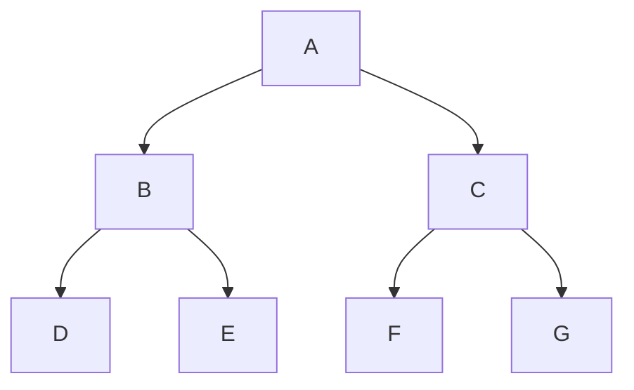
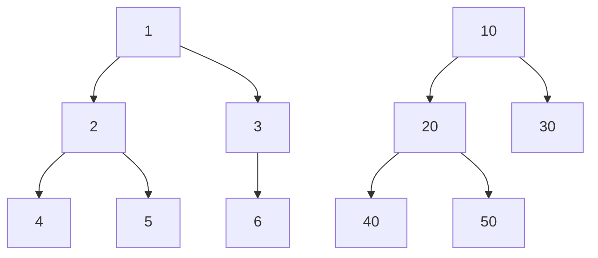
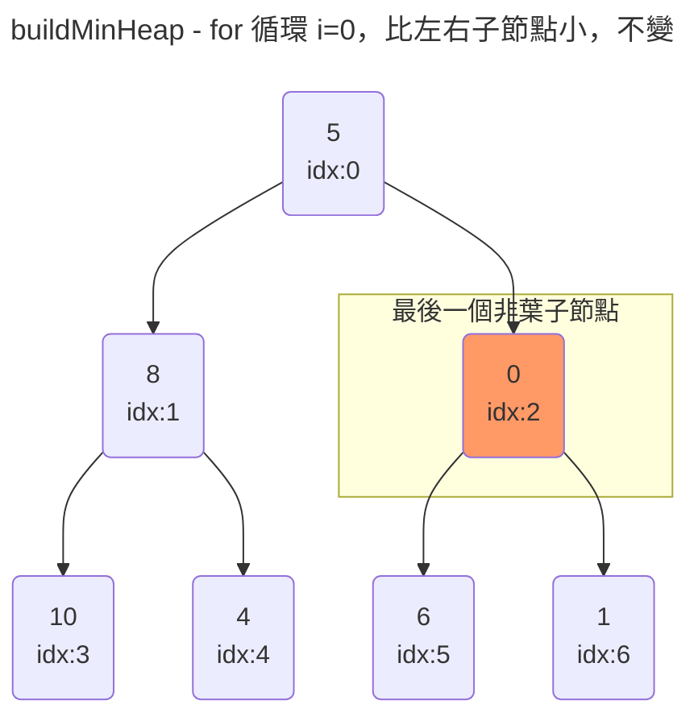
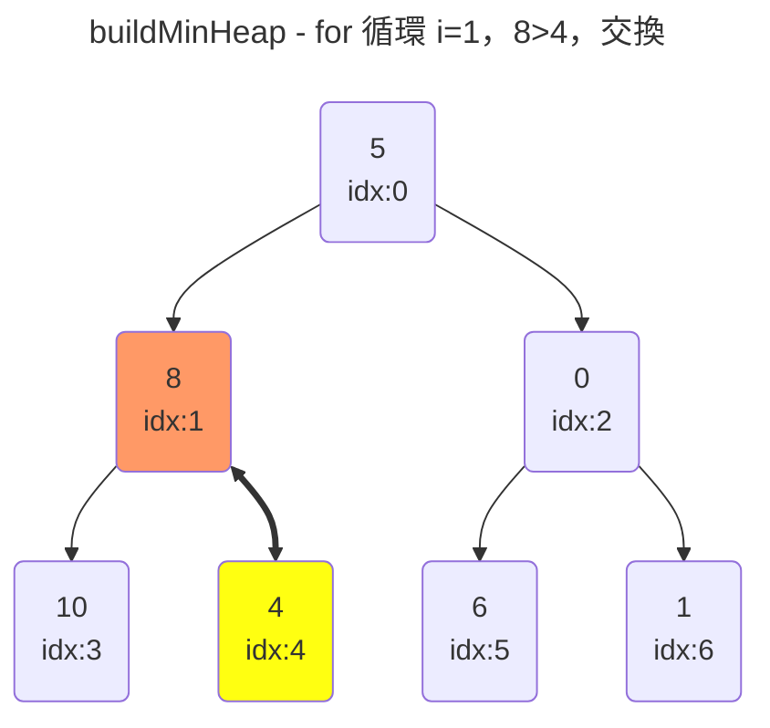
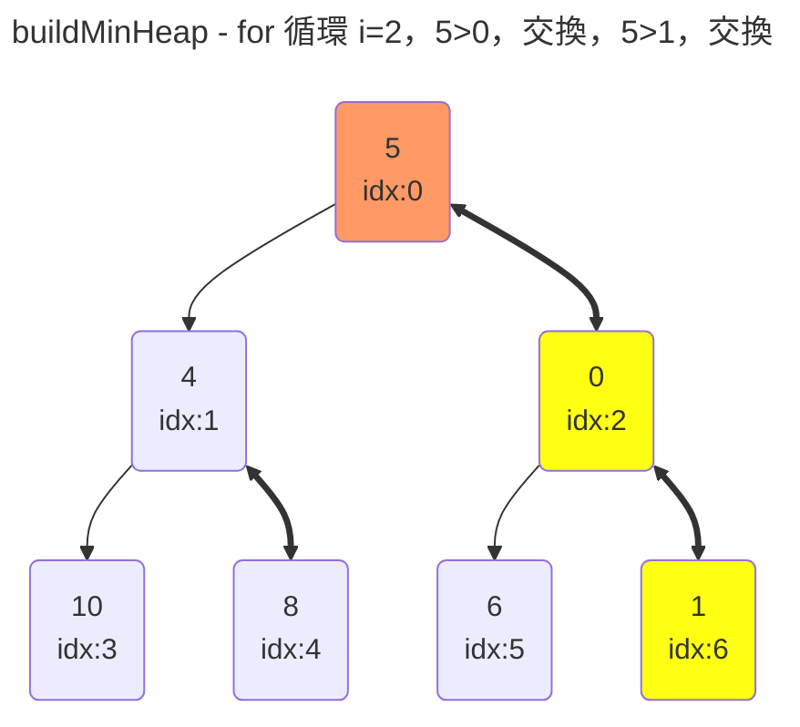
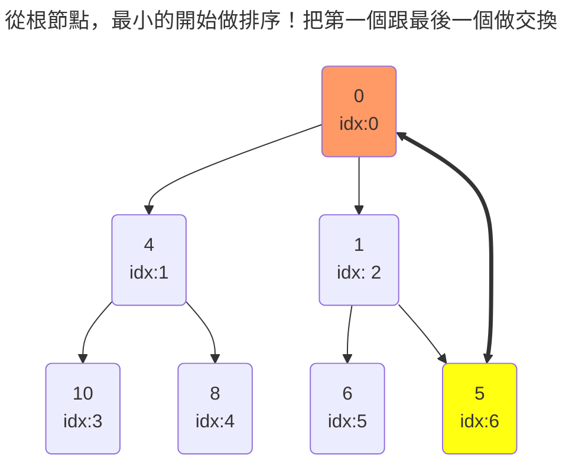
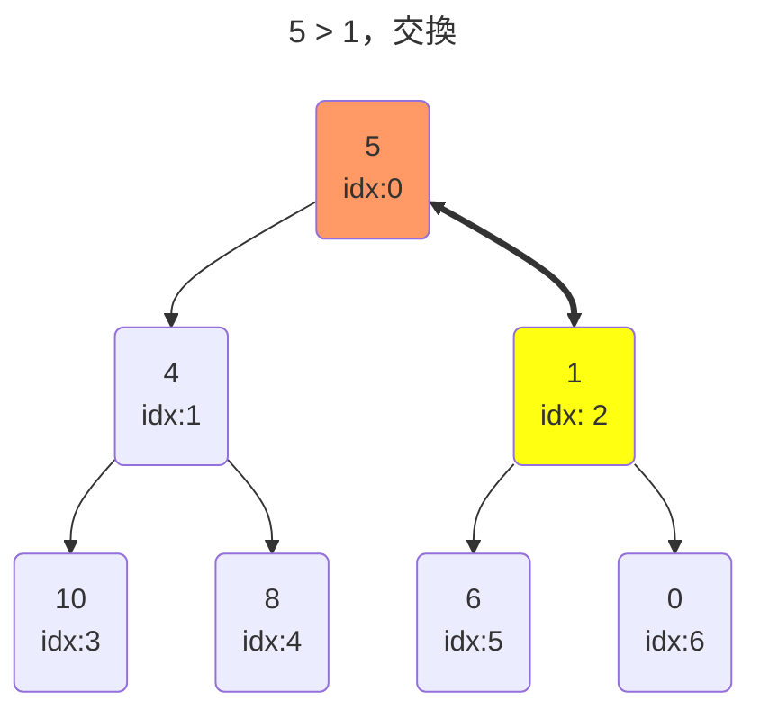
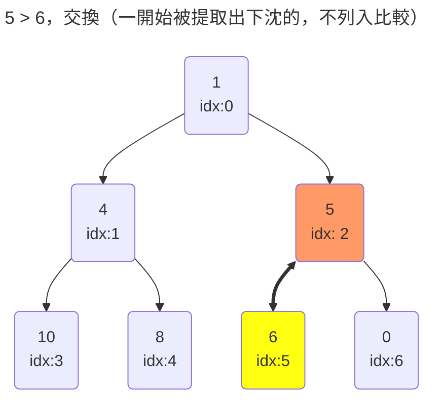

# 二叉堆



#### 二叉樹

講到二叉堆就要提到二叉樹，有幾項規則

1. 每個節點只能最多兩個子節點
2. 具有左右次序不能顛倒

##### 完全二叉樹

除了最後一層，都是完整且滿的樹，比如



#### 二叉堆

一種特殊的堆，是完全二叉樹，通常會有堆排序，將最小或是最大值放在頂端，根節點，最循環提取

- 學習資料：[《算法》(第 4 版) - chapter 2.4 堆排序](https://www.bilibili.com/video/BV1s94y1n72z/?share_source=copy_web&vd_source=34ac1b8e3ce252ba440c815f2d4f6cd3)

通常排序，會分類為兩種堆：

1. 最大堆：父節點的值總是大於子節點構成的二叉堆
2. 最小堆：父節點的值總是小於子節點構成的二叉堆

把堆由左至右，由上至下，加上索引變成陣列構成 `[k0, k1, k2, ...kn]`，這時取到其中的第 i 個，
則左子節點的索引為 `2i + 1`，右子節點為 `2i + 2`。
找到最後一個非葉子節點（至少有一個子節點的節點）的方式是 `Math.floor(arr.length / 2) - 1`。
如果已經子節點，要找父節點索引則為：`Math.floor((index - 1) / 2)`。

- 如果想要升序排序，要構造出最大堆，最大的會先被提取出來放在後面，最後構成升序陣列。
- 如果想要降序排序，要構造出最小堆，最小的會先被提取出來放在後面，最後構成降序陣列。

另外，堆排序是一種不穩定的排序，對於相同大小的元素，在排序之後有可能和排序之前的位置不同）

對亂序的陣列做降序排列

```js
/**
 * 最小堆排序
 * @param {Array} arr
 */
const minHeapSort = (arr) => {
  // 構造最小堆
  buildMinHeap(arr); // [0, 4, 1, 10, 8, 6, 5]
  // 從根節點，最小的開始做排序！把第一個跟最後一個做交換
  for (let i = arr.length - 1; i > 0; i--) {
    // 交換位置
    [arr[0], arr[i]] = [arr[i], arr[0]];
    // 最後一個已經交換下去了，是最小的，所以 endIndex-1 是倒數第二個值
    siftDown(arr, 0, i - 1);
  }
};

/**
 * 構造最小堆
 * @param {Array} arr
 */
const buildMinHeap = (arr) => {
  // 找出最後一個非葉子的子節點
  const startIndex = Math.floor(arr.length / 2) - 1;
  // 從最後一個非葉子的子節點開始做下沉
  for (let i = startIndex; i >= 0; i--) {
    console.log("i", i);
    siftDown(arr, i, arr.length - 1);
  }
};

/**
 * 下沈
 * @param {Array} arr
 * @param {Number} startIndex 開始的子節點
 * @param {Number} endIndex 最後一個子節點
 */
const siftDown = (arr, startIndex, endIndex) => {
  const leftChildIndex = startIndex * 2 + 1;
  const righChildtIndex = startIndex * 2 + 2;
  let idx = startIndex;
  // 如果有這個子節點的話
  if (leftChildIndex <= endIndex) {
    if (arr[leftChildIndex] < arr[startIndex]) {
      idx = leftChildIndex;
    }
  }
  // 如果有這個子節點的話
  if (righChildtIndex <= endIndex) {
    // 如果右子節點最小，比父節點和左子節點還要小
    if (
      arr[righChildtIndex] < arr[startIndex] &&
      arr[righChildtIndex] < arr[leftChildIndex]
    ) {
      idx = righChildtIndex;
    }
  }
  if (idx !== startIndex) {
    // 交換位置
    [arr[startIndex], arr[idx]] = [arr[idx], arr[startIndex]];
    // 新的位置，還有子節點的話，繼續下沈
    if (idx <= Math.floor(arr.length / 2) - 1) {
      siftDown(arr, idx, endIndex);
    }
  }
};
var arr1 = [5, 8, 0, 10, 4, 6, 1];
minHeapSort(arr1);
console.log(arr1); // [10, 8, 6, 5, 4, 1, 0]
```













在不斷針對根節點做下沈，被提取的都會是最小值放到最後，就會變成降序陣列。

#### React 採用最小堆

為什麼採用最小堆呢？在任務更新流程中，為了區分優先級，最快的方式就是用最小堆，內部的時間越小則任務的優先等級越高！
`scheduler` 的套件包中，就有兩個陣列，`taskQueue`和`timerQueue`，都是以最小堆的方式儲存，可以保證以`O(1)`的時間複雜度取出最頂端，優先級最高的任務。
他實作了五個函式 `push`, `pop`, `shifUp`, `siftDown`, `peek`

1. push，往最小堆插入新的節點
2. pop，刪除根節點（最小的值
3. siftUp，上浮，插入新的節點後，要把他放到對的位置
4. shiftDown，下沉，提取出根（最小值後，把最末端的元素放置根，讓整個堆重新排序
5. peek，獲取根節點（最小的值，也是優先級最高的任務

[源碼位置](https://github.com/facebook/react/blob/main/packages/scheduler/src/SchedulerMinHeap.js)

```js
// 插入新節點後，向上調整堆
export function push(heap, node) {
  const index = heap.length;
  heap.push(node);
  siftUp(heap, node, index);
}

// 獲取根節點
export function peek(heap) {
  return heap.length === 0 ? null : heap[0];
}

// 提取根節點後，拿到陣列最後一個元素，並刪除
// 如果兩者不相同的話，把最後一個元素提取到根做下沈處理
export function pop(heap) {
  if (heap.length === 0) {
    return null;
  }
  const first = heap[0];
  const last = heap.pop();
  if (last !== first) {
    heap[0] = last;
    siftDown(heap, last, 0);
  }
  return first;
}
// 假設 taskQueue=[{sortIndex: 2}, {sortIndex: 5}, {sortIndex: 7}, {sortIndex: 12}, {sortIndex: 22}, {sortIndex: 17}, {sortIndex: 25}];
// 做完pop(taskQueue)後 [{"sortIndex":5},{"sortIndex":12},{"sortIndex":7},{"sortIndex":25},{"sortIndex":22},{"sortIndex":17}]

// 從末端插入，向上比較直到根節點
function siftUp(heap, node, i) {
  let index = i;
  while (index > 0) {
    // 找父節點索引，相當於：`Math.floor((index - 1) / 2)`
    const parentIndex = (index - 1) >>> 1;
    const parent = heap[parentIndex];
    if (compare(parent, node) > 0) {
      // 如果父節點比較大，就交換
      heap[parentIndex] = node;
      heap[index] = parent;
      index = parentIndex;
    } else {
      // 父節點較小，跳出
      return;
    }
  }
}

function siftDown(heap, node, i) {
  let index = i;
  const length = heap.length;
  // 這相當於除二取整數
  const halfLength = length >>> 1;
  // 為什麼只需要比較一半就可以了呢？！
  // 可以理解為 非葉子節點是 Math.floor(heap.length / 2) - 1
  // 非葉子節點是不需要比較，也無法交換
  while (index < halfLength) {
    const leftIndex = (index + 1) * 2 - 1;
    const left = heap[leftIndex];
    const rightIndex = leftIndex + 1;
    const right = heap[rightIndex];

    // 如果和子節點比較，還要更小，就交換
    if (compare(left, node) < 0) {
      if (rightIndex < length && compare(right, left) < 0) {
        heap[index] = right;
        heap[rightIndex] = node;
        index = rightIndex;
      } else {
        heap[index] = left;
        heap[leftIndex] = node;
        index = leftIndex;
      }
    } else if (rightIndex < length && compare(right, node) < 0) {
      heap[index] = right;
      heap[rightIndex] = node;
      index = rightIndex;
    } else {
      // Neither child is smaller. Exit.
      return;
    }
  }
}

function compare(a, b) {
  // 先比較 sortIndex 再比較 id
  const diff = a.sortIndex - b.sortIndex;
  return diff !== 0 ? diff : a.id - b.id;
}
```

> 學習資料：
> [React 之最小堆（min heap）](https://juejin.cn/post/7168283003037155359)
> [React 算法之堆排序）](https://juejin.cn/post/6912008293007228936)
