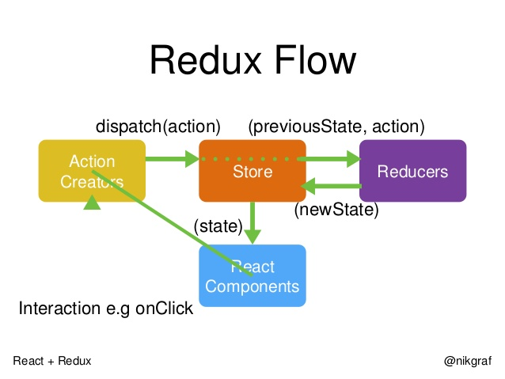

# 實作 Redux

基於函數式編程思想，集中式管理狀態、單向資料流

- 單一數據源：共用唯一的 Store
- Store 是只讀的：唯一改變的方法是 dispatch action
- 使用純函數修改

- 使用 redux 步驟
  1. 創建 store，回傳 getState、dispatch、subscribe
  2. reducer init，定義修改 store 規則
  3. getState (getter)：取當前 store
  4. dispatch (setter)：傳入 action 修改 store
  5. subscribe，定義訂閱 store 要做的事情：傳入 callback 在 store 更新時回調，回傳 取消訂閱的 callback，要注意回調時，不應操作 store 本身
